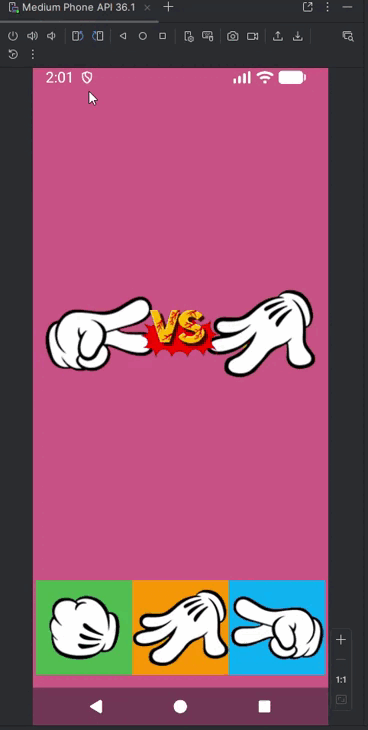

# JoKemPo - Android (Java)

Bem-vindo ao **JoKemPo**, um jogo clássico de Pedra, Papel ou Tesoura desenvolvido para a plataforma Android. Este projeto foi desenvolvido como parte do curso de desenvolvimento Android do instrutor **Tito Petri** na Udemy, com o objetivo de fixar conceitos fundamentais de interface e interação.

## 🚀 Funcionalidades

* **Escolha do Usuário:** Interface interativa utilizando `ImageButton`.
* **Lógica de Jogo:** Oponente (dispositivo) gera jogadas aleatórias através de lógica Java.
* **Feedback Sonoro:** Utilização da classe `MediaPlayer` para efeitos de som durante as jogadas.
* **Resultados em Tempo Real:** Verificação de vitória, derrota ou empate exibida via `Toast`.



## 🛠️ Tecnologias Utilizadas

* **Linguagem:** Java
* **IDE:** Android Studio
* **Componentes de UI:** `ImageButton`, `ImageView`, `TextView`.
* **Multimídia:** Classe `MediaPlayer` para execução de áudio.


## 📖 O que eu aprendi

Neste projeto, o foco foi entender como os componentes de imagem interagem com o código Java e como gerenciar recursos externos.

1.  **ImageButton:** Diferente de um botão comum, aprendi a customizar a experiência visual do usuário com ícones.
2.  **Lógica Condicional:** Implementação da lógica de comparação entre a escolha do jogador e a escolha gerada pelo sistema.
3.  **Gerenciamento de Mídia:** Criação e execução de sons (arquivos `.mp3` ou `.wav`) armazenados na pasta `res/raw`.

## ⚙️ Como executar o projeto

1.  **Clone este repositório:**
    ```bash
    git clone [https://github.com/RafaelDesenvolvedor1/JoKemPo---Java.git](https://github.com/RafaelDesenvolvedor1/JoKemPo---Java.git)
    ```
2.  Abra o projeto no **Android Studio**.
3.  Aguarde a sincronização do **Gradle**.
4.  Execute em um emulador ou dispositivo físico com **API 21+**.

## 🤝 Créditos

Desenvolvido por **Rafael** durante o curso de Android na Udemy.
* **Instrutor:** Tito Petri.
